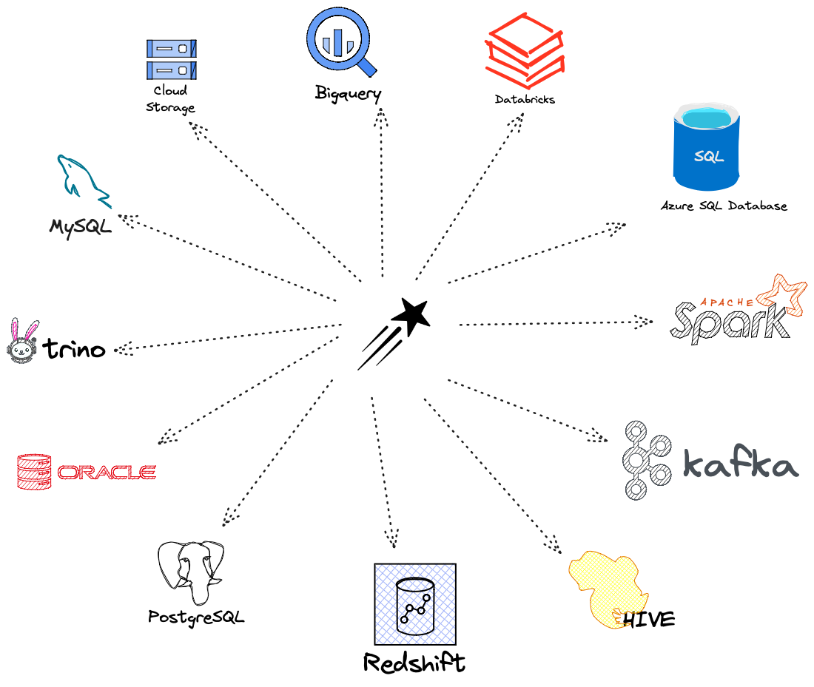

[](https://maven-badges.herokuapp.com/maven-central/ai.starlake/starlake-spark3_2.12)
[](https://opensource.org/licenses/Apache-2.0)
# About Starlake
Complete documentation available [here](https://starlake-ai.github.io/starlake/index.html)
# What is Starlake ?


Starlake is a configuration only Extract, Load,  Transform and Orchestration Declarative Data Pipeline Tool.
The workflow below is a typical use case:
* **Extract** your data as a set of Fixed Position, DSV (Delimiter-separated values) or JSON or XML files
* Define or infer table schemas fom test files (csv, json, xml, fixed-wdith ...)
* **Load**: Define transformations at load time using YAML and start **loading** files into your datawarehouse. 
* **Transform**: Build aggregates using regular SQL SELECT statements and let Starlake build your tables with respect to you selected strategy (Append, Overwrite, Merge ...).
* **Orchestrate**: Let Starlake handle your data lineage and run your data pipelines on your favorite orchestrator (Airflow, Dagster ... ).

You may use Starlake for Extract, Load and Transform steps or any combination of these steps.

## How is Starlake declarative ?

Looking at ELT tools, we can see that they are either:
- __Code based__: This is the case for example for Databricks or Meltano.
- __GUI based__: This is the case for example for Apache NiFi, Airbyte or Fivetran.

Looking at existing data orchestration tools, we can see that they are either:
- __Code based__: This is the case for example for Apache Airflow or Dagster.
- __GUI based__: This is the case for example for Apache NiFi or StreamSets.


Starlake is different because it is declarative, meaning that we define our data pipelines using a YAML DSL (Domain Specific Language)
instead of writing code or using a GUI.

These YAML files are then interpreted by Starlake runtime to execute your end to end data pipelines.

Among the properties you may specify in the YAML file, the following are worth mentioning:
* field normalization
* field encryption
* field renaming
* field removal
* field transformation
* field addition (computed fields)
* metrics computation
* semantic types by allowing you to set type constraints on the incoming data
* multiple file formats and source / target databases (Postgres, MySQL, SQL Server, Oracle, Snowflake, Redshift, BigQuery, ...)
* merge strategy (INSERT OVERWRITE or MERGE INTO)
* partitioning and clustering strategies
* data retention policies
* data quality rules
* data ownership
* data access policies
* schema evolution

The YAML DSL is self-explanatory and easy to understand. It is also very concise and easy to maintain.

The YAML DSL added value is best explained with an example:

### Extract

Let's say we want to extract data from a Postgres Server database on a daily basis
```yaml
extract:
  connectionRef: "pg-adventure-works-db" # or mssql-adventure-works-db i extracting from SQL Server
  jdbcSchemas:
    - schema: "sales"
      tables:
        - name: "salesorderdetail"              # table name or simple "*" to extract all tables
          partitionColumn: "salesorderdetailid" # (optional)  you may parallelize the extraction based on this field
          fetchSize: 100                        # (optional)  the number of rows to fetch at a time
          timestamp: salesdatetime              # (optional) the timestamp field to use for incremental extraction
      tableTypes:
        - "TABLE"
        #- "VIEW"
        #- "SYSTEM TABLE"
        #- "GLOBAL TEMPORARY"
        #- "LOCAL TEMPORARY"
        #- "ALIAS"
        #- "SYNONYM"
```

That's it, we have defined our extraction pipeline.

### Load

Let's say we want to load the data extracted from the previous example into a datawarehouse

```yaml
---
table:
  pattern: "salesorderdetail.*.psv" # This property is a regular expression that will be used to match the file name.
  schedule: "when_available"        # (optional) cron expression to schedule the loading
  metadata:
    mode: "FILE"
    format: "CSV"       # (optional) auto-detected if not specified
    encoding: "UTF-8"
    withHeader: yes     # (optional) auto-detected if not specified
    separator: "|"      # (optional) auto-detected if not specified
    writeStrategy:      
      type: "UPSERT_BY_KEY_AND_TIMESTAMP"
      timestamp: signup
      key: [id]         
                        # Please replace it by the adequate file pattern eq. customers-.*.psv if required
  attributes:           # Description of the fields to recognize
    - name: "id"        # attribute name and column name in the destination table if no rename attribute is defined
      type: "string"    # expected type
      required: false   # Is this field required in the source (false by default, change it accordingly) ?
      privacy: "NONE"   # Should we encrypt this field before loading to the warehouse (No encryption by default )?
      ignore: false     # Should this field be excluded (false by default) ?
    - name: "signup"    # second attribute
      type: "timestamp" # auto-detected if  specified
    - name: "contact"
      type: "string"
      ...
```

That's it, we have defined our loading pipeline.


### Transform

Let's say we want to build aggregates from the previously loaded data

```yaml

transform:
  default:
    writeStrategy: 
      type: "OVERWRITE"
  tasks:
    - name: most_profitable_products
      writeStrategy:
        type: "UPSERT_BY_KEY_AND_TIMESTAMP"
        timestamp: signup
        key: [id]
      sql: |              # based on the merge strategy and the current state,
          SELECT          # the SQL query will be translated into the appropriate MERGE INTO or INSERT OVERWRITE statement
            productid,
            SUM(unitprice * orderqty) AS total_revenue
            FROM salesorderdetail
            GROUP BY productid
            ORDER BY total_revenue DESC
```

Starlake will automatically apply the right merge strategy (INSERT OVERWRITE or MERGE INTO) based on `writeStrategy` property and the input /output tables .

### Orchestrate

Starlake will take care of generating the corresponding DAG (Directed Acyclic Graph) and will run it
whenever  the tables referenced in the SQL query are updated.

Starlake comes with a set of DAG templates that can be used to orchestrate your data pipelines on your favorite orchestrator (Airflow, Dagster, ...).
Simply reference them in your YAML files  and optionally customize them to your needs.


The following dependencies are extracted from your SQL query and used to generate the corresponding DAG:


The resulting DAG is shown below:


## Supported platforms

The Load & Transform steps support multiple configurations for inputs and outputs as illustrated in the figure below.


